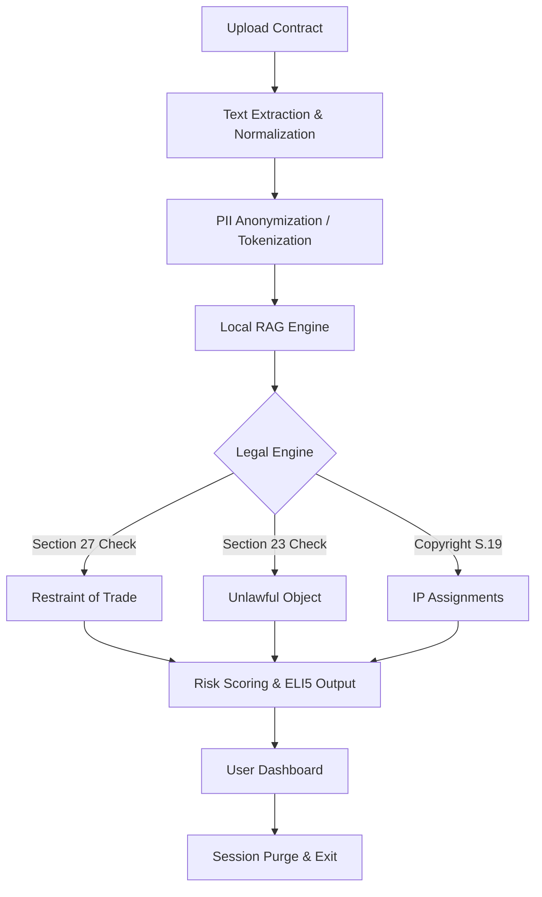

# Vidhi Setu: Technical & Statutory Deep-Dive ⚖️🚀

## 📋 Table of Contents

1. [The Problem: India's Freelance Legal Gap](#-the-problem-indias-freelance-legal-gap)
2. [The Solution: Privacy-First AI](#-the-solution-privacy-first-ai)
3. [Architecture & Pipeline](#-architecture--pipeline)
4. [Statutory Grounding (Indian Law)](#-statutory-grounding-indian-law)
5. [Competitive Edge](#-competitive-edge)

---

## 🌪️ The Problem: India's Freelance Legal Gap

India has the second-largest freelance workforce in the world (15M+). However:

- **Exclusion**: Top-tier legal counsel costs ₹20,000–₹50,000 per contract—prohibitive for most freelancers.
- **Predatory Terms**: Contracts often contain broad non-competes, unfair IP transfers, and unlimited indemnity.
- **US-Centric AI**: Existing AI tools are trained on US common law, citing "At-Will" employment or "Delaware Law" benchmarks which are irrelevant or misleading in India.

---

## 🛡️ The Solution: Privacy-First AI

**Vidhi Setu** is an "AI Legal Sentinel" designed as a first line of defense.

- **100% Local**: No cloud APIs. Contracts are processed in-memory using Ollama.
- **Explainable**: Don't just flag a risk—explain _why_ based on the Section and Act.
- **Deterministic + AI**: Combines regex-based statutory checks (high precision) with LLM-based nuance detection (high recall).

---

## 🏗️ Architecture & Pipeline

### 🔄 The Contract Analysis Pipeline

### 🧠 Local AI Component

We use **Ollama (Qwen 2.5 7B)** for:

1. **ELI5 Summarization**: Translating "The Assignee shall have the irrevocable right..." into "This means they own everything you create forever."
2. **Nuance Detection**: Picking up on subtle predatory phrasing that regex might miss.

---

## ⚖️ Statutory Grounding (Indian Law)

Unlike generic AI, Vidhi Setu is hard-coded to recognize and explain:

| Statute                       | Section             | Focus Area         | Vidhi Setu Action                         |
| ----------------------------- | ------------------- | ------------------ | ----------------------------------------- |
| **Indian Contract Act, 1872** | **Section 27**      | Restraint of Trade | Flags non-competes as likely void.        |
| **Indian Contract Act, 1872** | **Section 23**      | Unlawful Objects   | Detects terms that violate public policy. |
| **Indian Contract Act, 1872** | **Section 124-125** | Indemnity          | Explains financial liability exposure.    |
| **Copyright Act, 1957**       | **Section 19**      | IP Assignments     | Checks for mandatory royalty mentions.    |

---

## 🏁 Competitive Edge

| Feature            | Vidhi Setu                  | Enterprise Tools (SpotDraft, etc.) |
| ------------------ | --------------------------- | ---------------------------------- |
| **Privacy**        | **Total (Local Inference)** | Cloud-stored / API tracking        |
| **Target**         | **Freelancers & Startups**  | High-paying Corporate Legal Teams  |
| **Law Focus**      | **Indian Statutory Law**    | Global / US Common Law             |
| **Data Retention** | **Zero (In-Memory)**        | Permanent Records                  |
| **Cost**           | **Open/Local**              | $10,000+ per year                  |

---

_Disclaimer: Vidhi Setu provides legal analysis, not legal advice._
