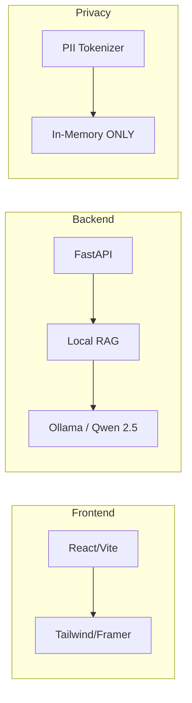

# Vidhi Setu 🇮🇳

**Privacy-First AI Contract Risk Analysis Grounded in Indian Law**

Vidhi Setu is an intelligent LegalTech platform designed specifically for the Indian creative community, freelancers, and early-stage startups. It bridges the gap between complex legal jargon and fair professional agreements by providing jurisdiction-aware risk assessment anchored in **The Indian Contract Act, 1872**.

---

## 💡 Why Vidhi Setu?

Traditional legal tech targets big corporations. **Vidhi Setu** is built for the **15 Million+ Indian Freelancers** who sign contracts every day without a lawyer.

- **⚖️ Built for India**: No US "At-Will" citations. Strictly Indian Statutes.
- **🔒 Absolute Privacy**: Your contract never leaves your RAM. Local AI processing means zero data leaks.
- **👶 ELI5 Mode**: Legal jargon is scary. Our AI translates it into plain English a 5-year-old can understand.

---

## 🛠️ Technology Stack



- **Frontend**: React (Vite), Tailwind CSS, Framer Motion, Lucide.
- **Backend**: FastAPI (Python), Local RAG Engine.
- **AI**: **Ollama (Qwen 2.5 7B)** for local, private inference.

---

## 🏁 Getting Started

### 1. 🧠 AI Engine Setup (Ollama)

This project runs 100% locally. You MUST have Ollama installed and the model imported:

1.  **Install Ollama** from [ollama.com](https://ollama.com).
2.  **Pull Qwen 2.5**:
    ```bash
    ollama run qwen2.5:7b
    ```
3.  **Import as Vidhi Brain**: Follow the instructions in `backend/ai/README.md` (or simply ensure a model named `vidhi-brain` is available in your local Ollama instance).

### 2. 🔌 Backend Setup

1.  Navigate to the `backend/` directory.
2.  Install dependencies:
    ```bash
    pip install -r requirements.txt
    ```
3.  Run the server:
    ```bash
    uvicorn main:app --reload
    ```

### 3. 🎨 Frontend Setup

1.  Navigate to the `frontend/` directory.
2.  Install dependencies:
    ```bash
    npm install
    ```
3.  Run the development server:
    ```bash
    npm run dev
    ```

---

## 🧪 Testing the Platform (Jury Guide)

To evaluate the full depth of Vidhi Setu's local legal intelligence:

1.  Access the **Dashboard** via the "Get Started" button.
2.  Upload a contract (e.g., from `sample_contracts/`) or click **"Test with Sample"**.
3.  Observe the **Section 27 (Non-Compete)** detection and the **Jurisdiction Guardrail** blocking non-Indian law.
4.  Notice the **Local AI Insight** cards providing plain-English legal explanations grounded in Indian Statute.

---

## ⚠️ Disclaimer

Vidhi Setu is an assistive tool intended to improve legal awareness and understanding. It does **not** provide legal advice. Users should always consult a qualified legal professional before signing any agreement.

---

**Vidhi Setu: Zero Data, Absolute Clarity.** 🚀⚖️
